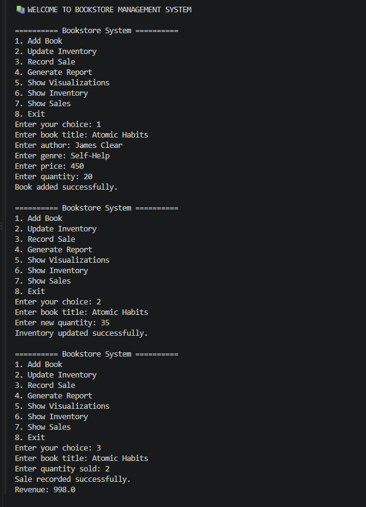
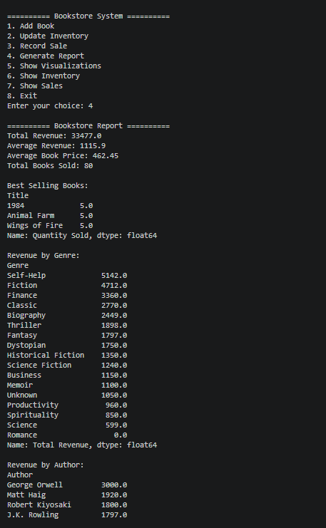
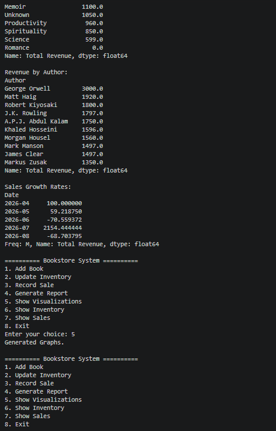
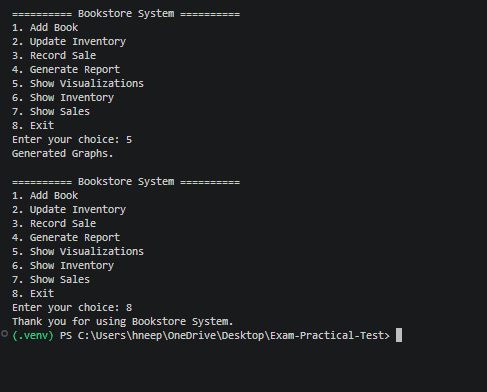
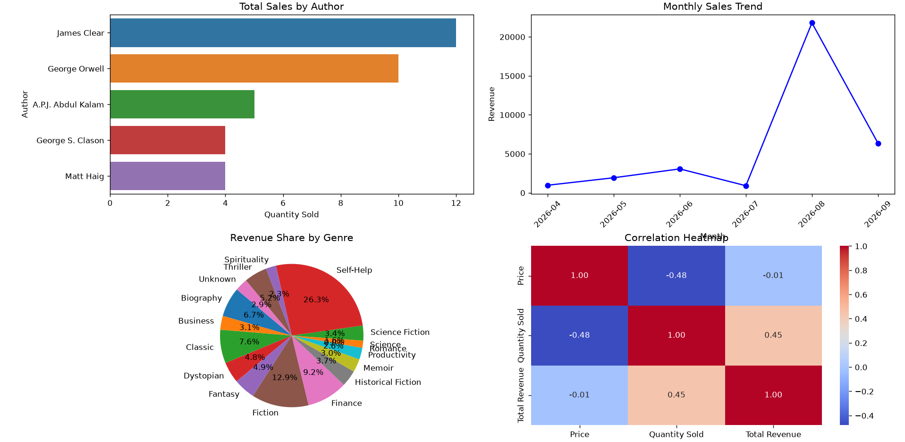

# Bookstore Management System

A Python-based bookstore management system using **OOP, NumPy, Pandas,
Matplotlib, and Seaborn** to manage inventory, record sales, analyze
revenue, and visualize sales data.

## Features

-   Add and update books in inventory
-   Record book sales and update stock
-   Calculate total revenue, average price, and total books sold
-   Find best-selling books
-   Analyze revenue by genre and author
-   Analyze monthly sales and growth
-   Generate Bar Chart, Line Chart, Pie Chart, and Heatmap
-   Handle missing and invalid data using Pandas

## Technologies

-   Python 3
-   Pandas
-   NumPy
-   Matplotlib
-   Seaborn
-   CSV

## Project Structure

``` text
bookstore-project/
│
├── bookstore_system.py
├── inventory.csv
├── sales.csv
└── README.md
```

## Dataset

### `inventory.csv`

``` text
Title, Author, Genre, Price, Quantity
```

### `sales.csv`

``` text
Date, Title, Quantity Sold, Total Revenue
```

## Installation

Install required libraries:

``` bash
pip install pandas numpy matplotlib seaborn
```

## Run the Project

Keep `bookstore_system.py`, `inventory.csv`, and `sales.csv` in the same
folder.

Run:

``` bash
python bookstore_system.py
```
## Video Demonstration
video Link:[]

## Sample output 



!


## Menu

``` text
1. Add Book
2. Update Inventory
3. Record Sale
4. Generate Report
5. Show Visualizations
6. Show Inventory
7. Show Sales
8. Exit
```
### Option 1 --- Add Book

Adds a new book to the inventory after taking its title, author, genre,
price, and quantity.

### Option 2 --- Update Inventory

Updates the available quantity of an existing book.

### Option 3 --- Record Sale

Records a book sale and automatically:

1.  Checks whether the book exists.
2.  Checks whether enough stock is available.
3.  Deducts the sold quantity from inventory.
4.  Calculates total revenue.
5.  Adds the sale to the sales DataFrame.

### Option 4 --- Generate Report

Displays:

-   Total revenue
-   Average revenue
-   Average book price
-   Total books sold
-   Top 3 best-selling books
-   Revenue by genre
-   Top authors by revenue
-   Monthly sales growth rates

### Option 5 --- Show Visualizations

Generates:

1.  Sales by author bar chart
2.  Monthly revenue line chart
3.  Revenue share by genre pie chart
4.  Correlation heatmap

### Option 6 --- Show Inventory

Displays the current inventory DataFrame.

### Option 7 --- Show Sales

Displays the current sales DataFrame.

### Option 8 --- Exit

Closes the bookstore application.

## Visualizations

1.  **Bar Chart** --- Sales by Author
2.  **Line Chart** --- Monthly Sales Trend
3.  **Pie Chart** --- Revenue by Genre
4.  **Heatmap** --- Correlation between Price, Sales, and Revenue

## Concepts Used

-   OOP: Class, Object, Constructor, Methods
-   Control Structures: `if-else`, `while`, `match-case`, `break`
-   Exception Handling: `try-except`
-   Pandas: Data loading, cleaning, grouping, merging
-   NumPy: Numerical calculations
-   Matplotlib & Seaborn: Data visualization


##  Future Improvements

Possible future enhancements include:

-   Delete books from inventory
-   Search books by title or author
-   Export generated reports to CSV
-   Add user authentication
-   Add a graphical user interface
-   Add low-stock alerts
-   Add daily/weekly/monthly sales dashboards
-   Save updated inventory and sales data back to CSV automatically


 ## Bookstore Management System**

A Python practical project demonstrating:

**Python + OOP + NumPy + Pandas + Matplotlib + Seaborn**
